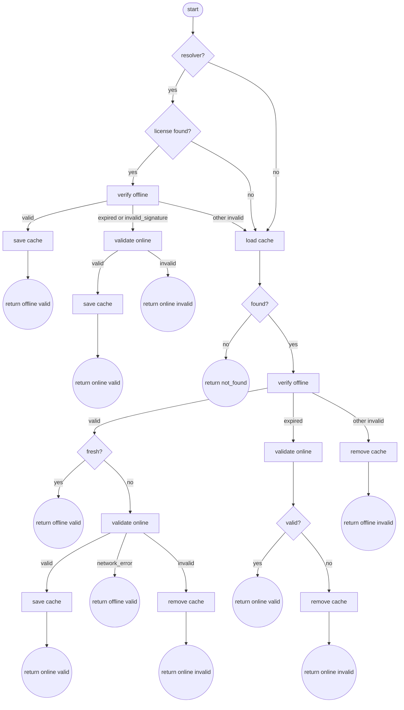

# License Check Flow

This section defines the canonical decision logic for license checks. It is
intended to be implemented the same way across languages, even if the IO layers
are different.

## Pseudocode

```
function check_license():
  machine = get_machine_fingerprint()

  if resolver exists:
    resolved = resolver.resolve(product_id)
    if resolved:
      offline = verify_offline(resolved.license_key, machine)
      if offline.valid:
        save_cache(resolved.license_key, machine)
        return offline

      if offline.reason in ["expired", "invalid_signature"]:
        online = validate_online(resolved.license_key, machine)
        if online.valid:
          save_cache(resolved.license_key, machine)
        return online

      // for other offline failures, fall through to cache check

  cached = load_cache(product_id)
  if cached:
    offline = verify_offline(cached.license_key, machine)
    if offline.valid:
      if cache_is_fresh(cached):
        return offline

      online = validate_online(cached.license_key, machine)
      if online.valid:
        save_cache(cached.license_key, machine)
        return online
      if online.reason == "network_error":
        return offline

      remove_cache(product_id)
      return online

    if offline.reason == "expired":
      online = validate_online(cached.license_key, machine)
      if not online.valid:
        remove_cache(product_id)
      return online

    remove_cache(product_id)
    return offline

  return { valid: false, reason: "not_found", offline_verified: false }
```

## State Machine (Mermaid)



## Notes

- "offline" refers to local signature verification only.
- "online" refers to API validation.
- Resolver is optional (TS SDK currently supports this as a pre-cache hook).
