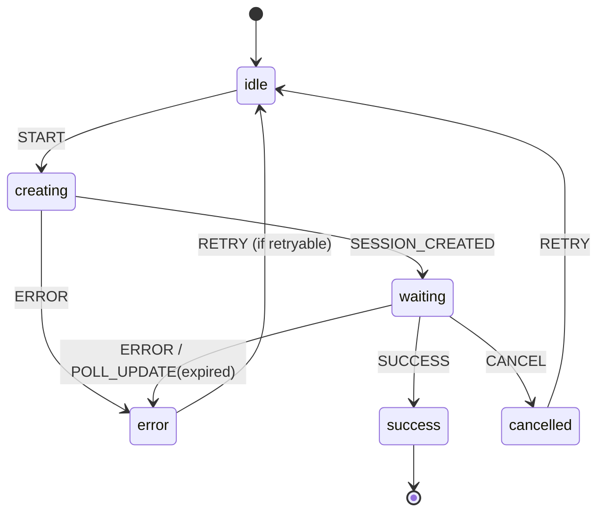

# Purchase Flow Spec

This section defines the canonical behavior for in-app purchases. It covers
checkout session creation, polling for completion, and license activation.

## Overview

Purchases use a browser-based checkout flow:
1. SDK creates a checkout session via API
2. User completes payment in browser (QR code or URL)
3. SDK polls for completion
4. On success, license key is returned and stored

## API Endpoints

### Create Checkout Session

```
POST /v1/checkout/sessions
Content-Type: application/json

{
  "productId": "prod_xxx",
  "email": "user@example.com",      // optional, pre-fills checkout
  "successUrl": "https://...",       // optional, redirect after success
  "cancelUrl": "https://..."         // optional, redirect on cancel
}

Response 200:
{
  "sessionId": "cs_xxx",
  "checkoutUrl": "https://checkout.stripe.com/c/pay/cs_xxx...",
  "expiresAt": 1700003600000
}
```

### Poll Checkout Status

```
GET /v1/checkout/sessions/:sessionId

Response 200:
{
  "sessionId": "cs_xxx",
  "status": "open" | "complete" | "expired",
  "licenseKey": "eyJ...",            // only when status == "complete"
  "expiresAt": 1700003600000
}
```

Note: `status` values match [Stripe's Checkout Session status](https://docs.stripe.com/api/checkout/sessions/object).

## Checkout Session States

Tuish uses Stripe's checkout session status values:

| Status | Description |
|--------|-------------|
| `open` | Session active, awaiting payment |
| `complete` | Payment successful, license issued |
| `expired` | Session timed out |

**Expiration:** Stripe sessions expire after 24 hours by default. Custom expiration
can be set between 30 minutes and 24 hours via `expires_at` parameter.

## Purchase Flow State Machine

```
type PurchaseFlowState =
  | { step: 'idle' }
  | { step: 'creating' }
  | { step: 'waiting', sessionId: string, checkoutUrl: string }
  | { step: 'success', license: LicenseDetails }
  | { step: 'error', error: string, retryable: boolean }
  | { step: 'cancelled' }

type PurchaseFlowAction =
  | { type: 'START' }
  | { type: 'SESSION_CREATED', sessionId: string, checkoutUrl: string }
  | { type: 'POLL_UPDATE', status: 'open' | 'complete' | 'expired' }
  | { type: 'SUCCESS', license: LicenseDetails }
  | { type: 'ERROR', error: string, retryable: boolean }
  | { type: 'CANCEL' }
  | { type: 'RETRY' }
```

### State Transitions



## Pseudocode

```
function purchase_in_browser(product_id, email?, open_browser?):
  session = api_create_checkout_session(product_id, email)

  if open_browser:
    open_url(session.checkout_url)

  return {
    session_id: session.session_id,
    checkout_url: session.checkout_url,
    expires_at: session.expires_at
  }

function wait_for_checkout_complete(session_id, options?):
  poll_interval = options.poll_interval_ms ?? 2000
  timeout = options.timeout_ms ?? 600000
  start_time = now_ms()

  while true:
    if now_ms() - start_time > timeout:
      return { valid: false, reason: "timeout" }

    status = api_get_checkout_status(session_id)

    if status.status == "complete":
      license_result = verify_license(status.license_key)
      if license_result.valid:
        store_license(status.license_key)
        return { valid: true, license: license_result.payload }
      return { valid: false, reason: "invalid_license" }

    if status.status == "expired":
      return { valid: false, reason: "expired" }

    options.on_poll?(status.status)
    sleep(poll_interval)
```

## Retryable vs Non-Retryable Errors

### Retryable Errors
- Session expired (user can start new checkout)
- Network errors during polling
- Temporary API errors (5xx)
- Timeout (poll exceeded timeout_ms)

### Non-Retryable Errors
- Invalid product ID (4xx)
- API authentication errors (401/403)
- Product not available for purchase

## Browser Opening

SDKs should support these options for `open_browser`:
- `true` (default): Attempt to open system browser
- `false`: Return URL only, let caller handle

Platform-specific browser opening:
- Node.js: Use `open` package or `child_process.exec`
- Go: `exec.Command("open", url)` / `xdg-open` / `start`
- Rust: `webbrowser` crate or `Command::new`
- Python: `webbrowser.open(url)`

## QR Code Display

For terminal applications, SDKs may generate QR codes containing the checkout
URL. Requirements:
- Use standard QR code format (ISO/IEC 18004)
- Include URL as-is (no shortening)
- Provide URL as text fallback below QR

QR rendering approaches:
- Unicode half-blocks for compact display
- ASCII art for maximum compatibility
- URL-only fallback if terminal width < 50 columns

## Concurrent Purchase Prevention

SDKs should prevent multiple simultaneous purchases:
- Track `checkout_in_progress` state
- Return early if purchase already in progress
- Clear state on completion, cancellation, or error

## Timeout Handling

Default timeouts:
- Checkout session: 24 hours server-side (Stripe default, configurable 30min-24hr)
- Client poll timeout: 10 minutes (client-side)
- Poll interval: 2 seconds

SDKs should allow customization:
```
{
  poll_interval_ms: 2000,    // Time between polls
  timeout_ms: 600000         // Max time to wait (10 min)
}
```

Note: Client timeout is typically shorter than server session expiry. Users can
restart purchase if client times out but Stripe session is still valid.

## Error Messages

Use these standardized error messages:

| Reason | Message |
|--------|---------|
| `timeout` | "Checkout timed out. Please try again." |
| `expired` | "Checkout session expired. Please try again." |
| `invalid_license` | "License verification failed after purchase." |
| `network_error` | "Network error. Please check your connection." |
| `invalid_product` | "Product not found or not available for purchase." |
| `already_in_progress` | "A purchase is already in progress." |

## CLI JSON Output

For `--json` mode, purchase commands should output:

### Create Checkout Session
```json
{
  "sessionId": "cs_xxx",
  "checkoutUrl": "https://checkout.stripe.com/...",
  "expiresAt": 1700003600000
}
```

### Poll Success
```json
{
  "success": true,
  "license": {
    "id": "lic_xxx",
    "features": ["core", "pro"],
    "expiresAt": "2026-01-01T00:00:00Z"
  }
}
```

### Poll Open (non-blocking mode)
```json
{
  "status": "open",
  "sessionId": "cs_xxx"
}
```

### Error
```json
{
  "error": "Checkout session expired. Please try again.",
  "retryable": true
}
```

## Exit Codes (CLI)

| Code | Meaning |
|------|---------|
| 0 | Success (purchase complete) |
| 1 | General error |
| 2 | Timeout / expired |
| 3 | User cancelled |
| 4 | Invalid product |

## Security Considerations

1. **No payment data**: SDKs never handle payment information directly.
   All payment processing happens in browser via Stripe.

2. **Session tokens**: Checkout session IDs are short-lived and single-use.

3. **License verification**: Always verify the returned license key before
   storing, even after successful purchase.

4. **HTTPS only**: All API calls must use HTTPS.

## Test Vectors

See `oss/spec/tests/vectors/purchase.json` for:
- Checkout session creation responses
- Poll status transitions
- Error scenarios
- State machine transitions
